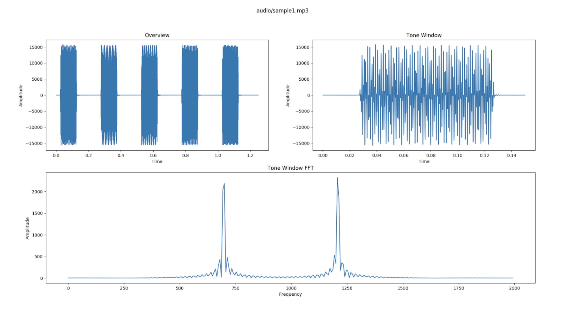

# Lab 08: Signal Processing

Files to submit via Vocareum below. 
- analyze.py
- decode.py
- lab08_writeup.txt
- Figures (sample3_1.png, … sample3_10.png, decode_demo.png)

### Introduction
Beep-beep-beeeep. That’s the sound of your telephone transmitting touch-tones or dual-tone multi-frequency signaling (DTMF) to telecommunications equipment at the other end of the phone line. These tones help to establish the link between your phone and the person you’re calling.

DTMF works by sending a unique pair of pure tones (sine waves) for any button you push on a keypad. Table 1 shows the pair of frequencies that each key on a DTMF keypad corresponds to. In this lab, you will decode a sequence of DTMF tones from an audio file to obtain a telephone number.

|        | 1209 Hz | 1336 Hz | 1477 Hz |
|--------|:-------:|:-------:|:-------:|
| 697 Hz |    1    |    2    |    3    |
| 770 Hz |    4    |    5    |    6    |
| 852 Hz |    7    |    8    |    9    |
| 941 Hz |    *    |    0    |    #    |

**Fig 1. DTMF Tone Table**

To decode the audio signal, you will be taking a fourier transform of the signal. Fourier analysis is fundamentally a method for expressing a function as a sum of periodic components, and for recovering the function from those components. When both the function and its Fourier transform are replaced with discretized counterparts, it is called the discrete Fourier transform (DFT). 

Because the discrete Fourier transform separates its input into components that contribute at discrete frequencies, it has a great number of applications in digital signal processing, e.g., for filtering, and in this context the discretized input to the transform is customarily referred to as a signal, which exists in the time domain. The output is called a spectrum or transform and exists in the frequency domain.

We will use [`numpy`'s `fft` function](https://numpy.org/doc/stable/reference/routines.fft.html) to perform the discrete Fourier transform.

### Github Classroom
[Join](https://classroom.github.com/a/fVhS4u4B) the new Github Classroom assignment.

Similar to before, you will create teams of up to two via the Github Classroom interface. Github will create a copy of our new starter code for this lab when you create a new team.

Please link yourself to your @usc.edu so we can identify you, especially if your Github account is anonymous in nature. If you make a mistake when forming teams, simply leave your team and rejoin using the Github Classroom link below.

### Setup
For this lab, you will be working in your VM. To install the necessary packages on Ubuntu, running the following commands:

```sh
sudo apt update
sudo apt install ffmpeg
sudo apt install python3-tk
sudo pip3 install pydub

# Execute this in the folder of the assignment where requirements.txt lives
sudo pip3 install -r requirements.txt
```

### Complete the Analyze Tool
There are mp3 audio files provided in this lab’s repository. We’ll be making use of a library called pydub to help us load and manipulate these files. You can read more about the library [here](https://github.com/jiaaro/pydub). While a complete understanding of the library is not necessary, you’ll need to develop a basic awareness of what it’s doing to help you complete this lab. The comments contained in the code should help guide you along.

The first part of this lab will require you to fill in the missing code for analyze.py, a tool developed to help you manually decode the DTMF signals. The skeleton is provided; all you need to do is add in the necessary plots so that the output looks as shown in Figure 1. A copy of the figure can be found in the lab’s Google Drive folder.

The first part of this lab will require you to fill in the missing code for analyze.py, a tool developed to help you manually decode the DTMF signals. The skeleton is provided; all you need to do is add in the necessary plots so that the output looks as shown in below.


Figure 1: Example output for `python analyze.py audio/sample1.mp3 0`

The first (top-left) subplot gives you an overview, plotting the entire audio signal in the time domain. It helps you to see where the tones are present in the signal. The second (top-right) subplot gives you a zoomed view of a particular slice of the audio file, the start time of which is determined by a command line argument (described below). Finally, the third (bottom) subplot shows the absolute value of the FFT, fast fourier transform, of the audio in the window. This shows the same slice in the frequency domain, and allows you to identify which tones/frequencies are present.

`analyze.py` has two required command-line arguments.
Usage: `analyze.py [file] [start_time]`
- `[file]`: the name of an mp3 file you would like to load
- `[start_time]`: the start time (in seconds) of the window you would like to focus on

**Note**: NumPy may raise a ComplexWarning - you can ignore this.

### Analyze the Audio
The audio directory contains three mp3 files: `sample1.mp3`, `sample2.mp3`, and `sample3.mp3`. The `readme.txt` file in that folder tells you the number for the first two samples. 

Using `analyze.py`, practice on the first two samples and then move on to decode `sample3.mp3`.

You may assume that each tone segment is 0.25 seconds in length.

**Question 1**: *What is the phone number dialed in `sample3.mp3`?*

Screenshot the 10 figures you used to determine the phone number dialed in `sample3.mp3`. 
Save these as `sample3_1.png`, `sample3_2.png`, …, `sample3_10.png` to upload to Vocareum.

### Automatic Decoder
Now that you have experience with manually decoding the DTMF tones, you will develop an algorithm to teach a computer how to do this for you automatically. Fill in the “TODO”'s in `decode.py`. 

For `get_peak_frqs()`, you will need to use your experience from Part 2 to programmatically determine the two peak frequencies as you were doing before visually.

Screenshot your terminal showing the output of `python decode.py audio/sample3.mp3`
Save this as `decode_demo.png` and upload to Vocareum.

**Question 2**: *Describe your algorithm. Explain what each of these functions do:* - `get_peak_frqs()`
- `get_max_frq()`
- `get_number_from_frq()`

|   Points  |                                                              Description                                                              |
|:---------:|:--------------------------------------------------------------------------------------------------------------------------------------|
|  **Demo** | sample3_1.png, … sample3_10.png, decode_demo.png (or zip file containing these if the files exceed the size limit)                    |
|     3     | The analysis figures are submitted (all 10 files). The plots correctly display the overview, tone window, and FFT of the tone window. |
|     2     | The decode script outputs the peak frequencies for each sample, and prints the decoded phone number.                                  |
|  **Code** | analyze.py, decode.py                                                                                                                 |
|     1     | List all team member names and the link to your github repo in the comments at the top of each file.                                  |
|     3     | Each plot in analyze.py plots the correct values along the x and y axes.                                                              |
|     1     | Plots all have a subplot title, x label, and y label.                                                                                 |
|     2     | get_peak_frqs() correctly returns the two peak frequencies.                                                                           |
|     2     | get_number_from_frq() returns the correct DTMF tone table entry.                                                                      |
|     2     | main() correctly processes each slice of the sample and prints the two peak frequencies. main() prints the decoded input.             |
|**Questions**| lab08_writeup.txt                                                                                                                     |
|     1     | Question 1                                                                                                                            |
|     3     | Question 2                                                                                                                            |
|           | Total Possible: 20                                                                                                                    |